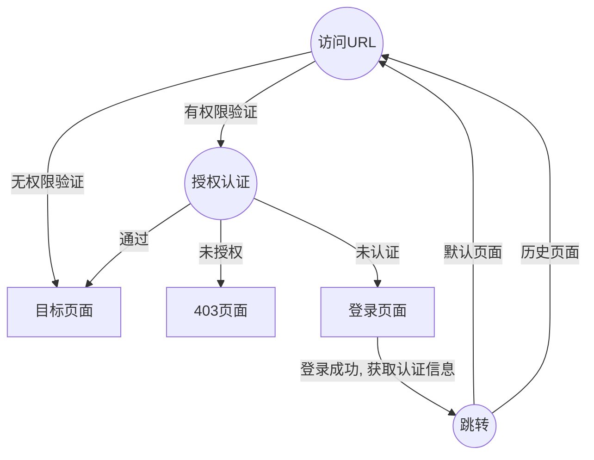

### 概述

`Auth` - 认证及授权插件， 系统认证相关的通用操作， 支持权限控制

认证实体(`Principle`)包含以下三种信息

- `username` - 用户唯一标识符（必需）
- `roles` - 角色列表 （可选）
- `authorities` - 权限列表 （可选）

### 流程



其中url权限控制部分需要自行实现， `Auth` 提供 `access`、`loadPrinciple`、`authenticated` 等方法


### 默认配置

```js

{
    token: {
      enabled: true,
      key: 'X-Token',
      storage: {
        get: function () {
          return window.localStorage['X-Token']
        },
        set: function (token: string) {
          window.localStorage['X-Token'] = token
        }
      }
    },
    excludeRedirectPages: ['/login', '/error/**'],
    loginPage: '/login',
    successPage: '/',
    cascade: {
      enabled: false,
      pid: 'code',
      children: 'children'
    },
    // deniedPage: '/error/403',
    urls: {
      login: '/login',
      logout: '/logout',
      loadPrinciple: '/principle'
    },
    login: function (req: any): Promise<{token: string}> {
      let http = Vue.prototype.$http as any
      if (http) {
        return http.post(this.urls.login, req)
      }
      throw new Error('not implemented')
    },
    logout: function (): Promise<any> {
      let http = Vue.prototype.$http as any
      if (http) {
        return http.delete(this.urls.logout)
      }
      throw new Error('not implemented')
    },
    loadPrinciple: function <T extends Principle> (): Promise<T> {
      let http = Vue.prototype.$http as any
      if (http) {
        return http.get(this.urls.loadPrinciple)
      }
      throw new Error('not implemented')
    }
}

```

### API

#### 属性

- `principle: Principle` - 认证实体

```js
{
  roles: {
     code: string
  }[],
  authorities: {
     pid: string
  }[],
  username: string
}

```

- `token: string` - 令牌， 令牌可用于解决串号、csrf 等问题

- `authenticated: boolean` [readonly] - 是否已验证过

- `username: string` [readonly] - 用户唯一标识


#### 方法

- `login (req: any): Promise<any>` - 登录

- `logout (): Promise<any>` - 登出

- `loadPrinciple (): Promise<Principle>` - 加载认证实体

- `access (pid: string): Promise<boolean>` - 权限访问

- `hasRole (...roles: string[]): boolean` - 角色判断

- `invalidate (): void` - 失效
