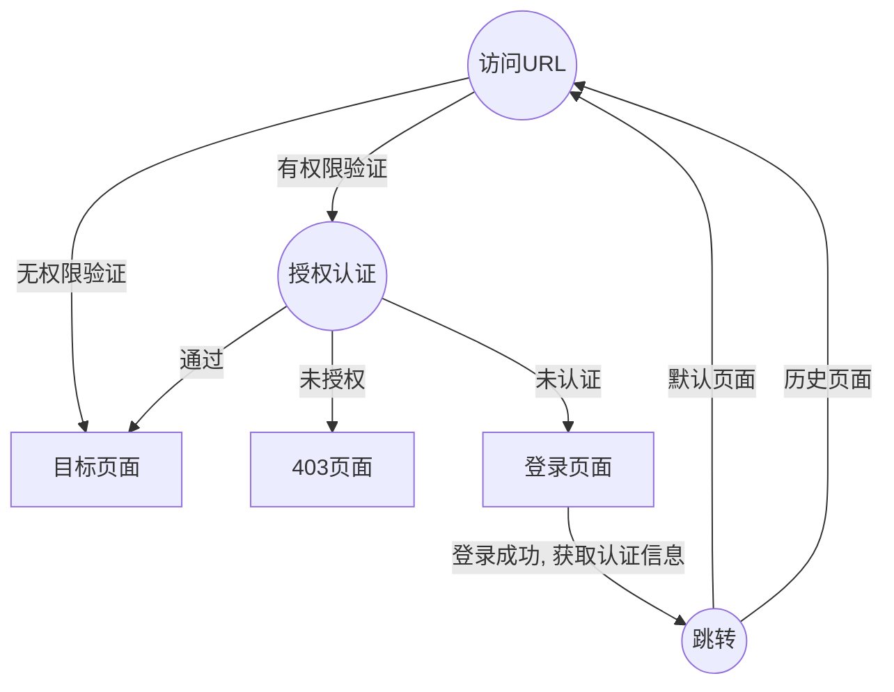

### 概述

`Auth` - 认证及授权插件， 系统认证相关的通用操作， 支持权限控制

认证实体(`Principle`)包含以下三种信息

- `username` - 用户唯一标识符（必需）
- `roles` - 角色列表 （可选）
- `authorities` - 权限列表 （可选）

### 流程

其中url权限控制部分需要自行实现， `Auth` 提供 `access`、`loadPrinciple`、`authenticated` 等方法